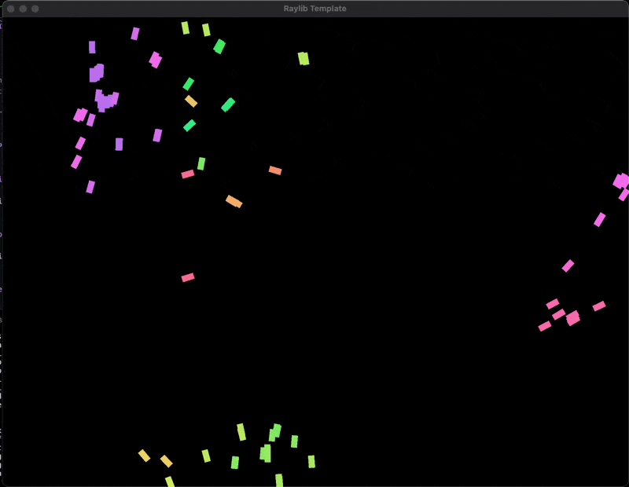

## Boid Implementation in C++ Raylib

This is a simple implementation of the Boid algorithm in C++ using the Raylib library. The Boid algorithm is a simple algorithm that simulates the flocking behavior of birds. The algorithm is based on three simple rules:

1. **Separation**: Boids will avoid getting too close to each other.
2. **Alignment**: Boids will try to align their velocity with the average velocity of their neighbors.
3. **Cohesion**: Boids will try to move towards the average position of their neighbors.

## How to run

- 1. Clone the repository using `git clone --recursive https://github.com/burakssen/boids.git`
- 2. Run `mkdir build && cd build`
- 3. Run `cmake ..`
- 4. Run `make`
- 5. Run `./boids`

## Screenshots

